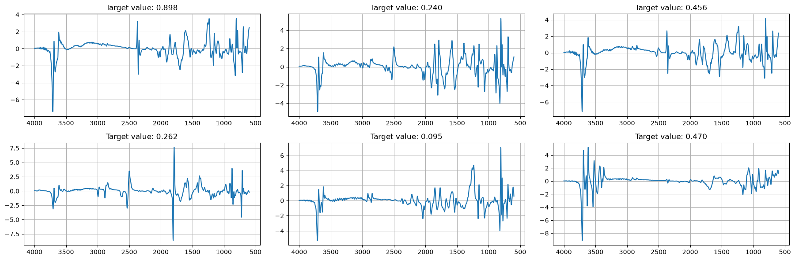
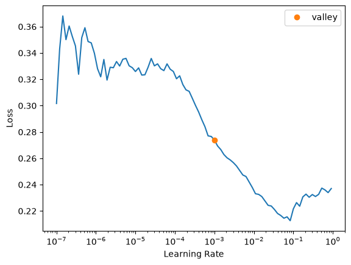

# SoilSpecDL


<!-- WARNING: THIS FILE WAS AUTOGENERATED! DO NOT EDIT! -->

SoilSpecDL trains deep learning models on soil infrared spectra. It builds [fastai](https://www.fast.ai/) `DataLoaders` from spectra and soil properties, and provides 1D convolutional neural networks (CNNs) for spectra, including the architecture of [Albinet et al. (2022)](https://doi.org/10.1016/j.aiia.2022.10.001). Any fastai `Learner` can then train them, with fastai’s learning rate finder, one-cycle training and callbacks.

SoilSpecDL follows the fastai philosophy: state-of-the-art deep learning should be accessible to domain scientists, not just to machine learning practitioners. If you are a soil scientist who uses R packages like `resemble` or `prospectr`, this package is designed with you in mind. Training a CNN on a large MIR spectral library should take a few lines of code, not a PhD in machine learning.

SoilSpecDL is part of a Python ecosystem for soil spectroscopy:

- [SoilSpecData](https://fr.anckalbi.net/soilspecdata/) loads the Open Soil Spectral Library (OSSL) as spectra and soil properties ready for machine learning.
- [SoilSpecTfm](https://fr.anckalbi.net/soilspectfm/) preprocesses spectra with scikit-learn transformers.
- SoilSpecDL trains deep learning models on them.

## Installation

``` sh
pip install -U soilspecdl
```

To install the development version, with nbdev, run this in the project root with [uv](https://docs.astral.sh/uv/):

``` sh
uv sync --extra dev
```

## Quick start

`from soilspecdl.all import *` imports every SoilSpecDL function and class. Each also has its own module, such as `soilspecdl.models`, for explicit imports. The fastai imports show what SoilSpecDL uses from fastai: the `Learner`, a loss, a metric, and the training schedule that adds `fit_one_cycle` and `lr_find`.

This example predicts exchangeable potassium (Kex) from the MIR spectra of the Open Soil Spectral Library (OSSL). [SoilSpecData](https://fr.anckalbi.net/soilspecdata/) gives the spectra and Kex values of every OSSL sample that has both. The first call to `load_ossl` downloads about 1 GB, and loading needs about 12 GB of memory. The example preprocesses the spectra with standard normal variate (SNV) and a first derivative, and log-transforms Kex, whose distribution is skewed. Then it trains [`MirzaiCNN`](https://franckalbinet.github.io/soilspecdl/models.html#mirzaicnn), the CNN of [Albinet et al. (2022)](https://doi.org/10.1016/j.aiia.2022.10.001):

``` python
import numpy as np
from sklearn.pipeline import Pipeline
from soilspecdata.all import *
from soilspectfm.all import *
from fastai.learner import Learner
from fastai.losses import MSELossFlat
from fastai.metrics import R2Score
from fastai.callback.schedule import *
from soilspecdl.all import *
```

``` python
mir = load_ossl().mir()
X, y, ids = mir.xy('k.ext_usda.a725_cmolc.kg')
pipe = Pipeline([
    ('snv', SNV()),
    ('deriv', SavitzkyGolay(deriv=1))])
X_tfm = pipe.fit_transform(X)
y_tfm = np.log1p(y.flatten())
```

[`get_spectral_dls`](https://franckalbinet.github.io/soilspecdl/dataloader.html#get_spectral_dls) splits the samples into train, validation and test sets, and returns the fastai `DataLoaders` and the test set’s indices. [`StandardizeSpectrum`](https://franckalbinet.github.io/soilspecdl/transforms.html#standardizespectrum) rescales each spectrum after the derivative has shrunk it, to the scale a CNN’s weight initialization expects. Each spectrum in a batch plots against its wavenumbers:

``` python
dls, test_idx = get_spectral_dls(
    X_tfm, y_tfm, mir.wavenumbers,
    batch_tfms=[StandardizeSpectrum()])
dls.show_batch(max_n=6, ncols=3)
```



Train [`MirzaiCNN`](https://franckalbinet.github.io/soilspecdl/models.html#mirzaicnn) with a fastai `Learner`, with mean squared error as the loss and R² as the metric:

``` python
learn = Learner(
    dls, MirzaiCNN(),
    loss_func=MSELossFlat(),
    metrics=R2Score())
```

Find a learning rate, then train:

``` python
learn.lr_find()
```

<style>
    progress { appearance: none; border: none; border-radius: 4px; width: 300px;
        height: 20px; vertical-align: middle; background: #e0e0e0; }
&#10;    progress::-webkit-progress-bar { background: #e0e0e0; border-radius: 4px; }
    progress::-webkit-progress-value { background: #2196F3; border-radius: 4px; }
    progress::-moz-progress-bar { background: #2196F3; border-radius: 4px; }
&#10;    progress:not([value]) {
        background: repeating-linear-gradient(45deg, #7e7e7e, #7e7e7e 10px, #5c5c5c 10px, #5c5c5c 20px); }
&#10;    progress.progress-bar-interrupted::-webkit-progress-value { background: #F44336; }
    progress.progress-bar-interrupted::-moz-progress-value { background: #F44336; }
    progress.progress-bar-interrupted::-webkit-progress-bar { background: #F44336; }
    progress.progress-bar-interrupted::-moz-progress-bar { background: #F44336; }
    progress.progress-bar-interrupted { background: #F44336; }    
&#10;    table.fastprogress { border-collapse: collapse; margin: 1em 0; font-size: 0.9em; }
    table.fastprogress th, table.fastprogress td { padding: 8px 12px; border: 1px solid #ddd; text-align: left; }
    table.fastprogress thead tr { background: #f8f9fa; font-weight: bold; }
    table.fastprogress tbody tr:nth-of-type(even) { background: #f8f9fa; }
</style>

``` html
<div></div>
```

    SuggestedLRs(valley=0.0010000000474974513)



``` python
learn.fit_one_cycle(20, lr_max=1e-3)
```

``` html
<div>
  <table class="fastprogress">
    <thead>
      <tr>
        <th>epoch</th>
        <th>train_loss</th>
        <th>valid_loss</th>
        <th>r2_score</th>
        <th>time</th>
      </tr>
    </thead>
    <tbody>
      <tr>
        <td>0</td>
        <td>0.095762</td>
        <td>0.075750</td>
        <td>0.464282</td>
        <td>00:07</td>
      </tr>
      <tr>
        <td>1</td>
        <td>0.075270</td>
        <td>0.065856</td>
        <td>0.534250</td>
        <td>00:08</td>
      </tr>
      <tr>
        <td>2</td>
        <td>0.067920</td>
        <td>0.217066</td>
        <td>-0.535135</td>
        <td>00:08</td>
      </tr>
      <tr>
        <td>3</td>
        <td>0.065452</td>
        <td>0.174799</td>
        <td>-0.236214</td>
        <td>00:08</td>
      </tr>
      <tr>
        <td>4</td>
        <td>0.056049</td>
        <td>0.107070</td>
        <td>0.242781</td>
        <td>00:08</td>
      </tr>
      <tr>
        <td>5</td>
        <td>0.052376</td>
        <td>0.064878</td>
        <td>0.541171</td>
        <td>00:07</td>
      </tr>
      <tr>
        <td>6</td>
        <td>0.051645</td>
        <td>0.072169</td>
        <td>0.489606</td>
        <td>00:08</td>
      </tr>
      <tr>
        <td>7</td>
        <td>0.052505</td>
        <td>0.051545</td>
        <td>0.635461</td>
        <td>00:08</td>
      </tr>
      <tr>
        <td>8</td>
        <td>0.043817</td>
        <td>0.095978</td>
        <td>0.321224</td>
        <td>00:07</td>
      </tr>
      <tr>
        <td>9</td>
        <td>0.043177</td>
        <td>0.038569</td>
        <td>0.727231</td>
        <td>00:08</td>
      </tr>
      <tr>
        <td>10</td>
        <td>0.035958</td>
        <td>0.045942</td>
        <td>0.675091</td>
        <td>00:07</td>
      </tr>
      <tr>
        <td>11</td>
        <td>0.033559</td>
        <td>0.036335</td>
        <td>0.743031</td>
        <td>00:07</td>
      </tr>
      <tr>
        <td>12</td>
        <td>0.030954</td>
        <td>0.034623</td>
        <td>0.755139</td>
        <td>00:07</td>
      </tr>
      <tr>
        <td>13</td>
        <td>0.031828</td>
        <td>0.034456</td>
        <td>0.756324</td>
        <td>00:10</td>
      </tr>
      <tr>
        <td>14</td>
        <td>0.031579</td>
        <td>0.035145</td>
        <td>0.751448</td>
        <td>00:08</td>
      </tr>
      <tr>
        <td>15</td>
        <td>0.028053</td>
        <td>0.032126</td>
        <td>0.772796</td>
        <td>00:07</td>
      </tr>
      <tr>
        <td>16</td>
        <td>0.027793</td>
        <td>0.031156</td>
        <td>0.779655</td>
        <td>00:08</td>
      </tr>
      <tr>
        <td>17</td>
        <td>0.026475</td>
        <td>0.031309</td>
        <td>0.778577</td>
        <td>00:08</td>
      </tr>
      <tr>
        <td>18</td>
        <td>0.028219</td>
        <td>0.030562</td>
        <td>0.783858</td>
        <td>00:08</td>
      </tr>
      <tr>
        <td>19</td>
        <td>0.026852</td>
        <td>0.030464</td>
        <td>0.784555</td>
        <td>00:08</td>
      </tr>
    </tbody>
  </table>
</div>
```

## Upgrading from 0.0.x

Version 0.1.0 changes the API of `soilspecdl`. To update code written for version 0.0.x:

- [`MirzaiCNN`](https://franckalbinet.github.io/soilspecdl/models.html#mirzaicnn) is now a function that returns a [`SpectralCNN`](https://franckalbinet.github.io/soilspecdl/models.html#spectralcnn). It no longer accepts `out_channel` or `conv_block_cls`. Weights saved from version 0.0.x load unchanged.
- [`FeatureExtractor`](https://franckalbinet.github.io/soilspecdl/models.html#featureextractor) takes the output channels of each block as `nfs`, instead of `out_channel` and `n_layers`. It returns `(batch, channels)` instead of `(batch, channels, 1)`.
- [`SpectralBlock()`](https://franckalbinet.github.io/soilspecdl/dataloader.html#spectralblock) is now `SpectralBlock(wns)`.
- The `TensorSpectrum.wns` class attribute is gone. Each spectrum carries its wavenumbers in `wns`, and [`get_spectral_dls`](https://franckalbinet.github.io/soilspecdl/dataloader.html#get_spectral_dls) stores them once in `dls.wns`.
- [`get_spectral_dls`](https://franckalbinet.github.io/soilspecdl/dataloader.html#get_spectral_dls) raises a `ValueError` when `wns` does not have one value per column of `X`.
- [`get_splitter`](https://franckalbinet.github.io/soilspecdl/dataloader.html#get_splitter) raises a `ValueError` when `train_pct + valid_pct` exceeds 1. Before, its check could never fail.
- `get_fuku_cs137`, `ConvBlockBaseline`, `RegressionFloatBlock`, `SpectralTarget`, `cnt_params`, `get_mir_k_1k_smp` and the `soilspecdl.core` module are gone. To count a model’s parameters, use fastai’s `learn.summary()`. For example data, use [`load_toy_kssl`](https://franckalbinet.github.io/soilspecdl/datasets.html#load_toy_kssl).
- SoilSpecDL now requires SoilSpecData 0.2.1 or later, and SoilSpecTfm 0.1.1 or later.

## Contributing

Contributions are welcome. SoilSpecDL is built with [nbdev](https://nbdev.fast.ai/): the notebooks in `nbs/` are the source of the code, the documentation and the tests. After changing a notebook, export the code, run the tests, clean the notebooks and rebuild the README with:

``` sh
uv run nbdev-prepare
```

Report bugs and ask questions in [GitHub issues](https://github.com/franckalbinet/soilspecdl/issues).

## License

SoilSpecDL is under the [Apache 2.0](LICENSE) licence. The toy dataset comes from OSSL, which publishes KSSL data under [CC BY 4.0](https://creativecommons.org/licenses/by/4.0/).
